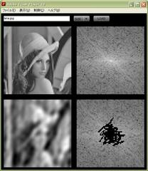

This Flash application generates amplitude spectrum of JPG image, then you can partially reconstruct the original image by picking up frequency elements.

  
[Visit here to try this  out](http://objective.oteage.net/FlashPhysics/FourierAnalysis.html)

On the upper left is the original image(Lenna). The right image is the amplitude spectrum of the original image.  
When you click or drag on the lower right image, the only component which the cursor points on Fourier(frequency) domain will be picked up and put back into original domain, which is located on the left bottom.  
The more you restore the Fourier component, the more restored image gets clear.  
Note that the main components of the image are concentrated on the center; there are low frequencies of the Fourier domain.  
In case of heavy response or changing resolution, change the image size by the upper SIZE button  

You can use another image by selecting an image from Flickr(JPG only), copy the URL of the image and paste its string on the text field,  
then press the LOAD button. (Any image except Flickr cannot be loaded because of some technical reasons).
